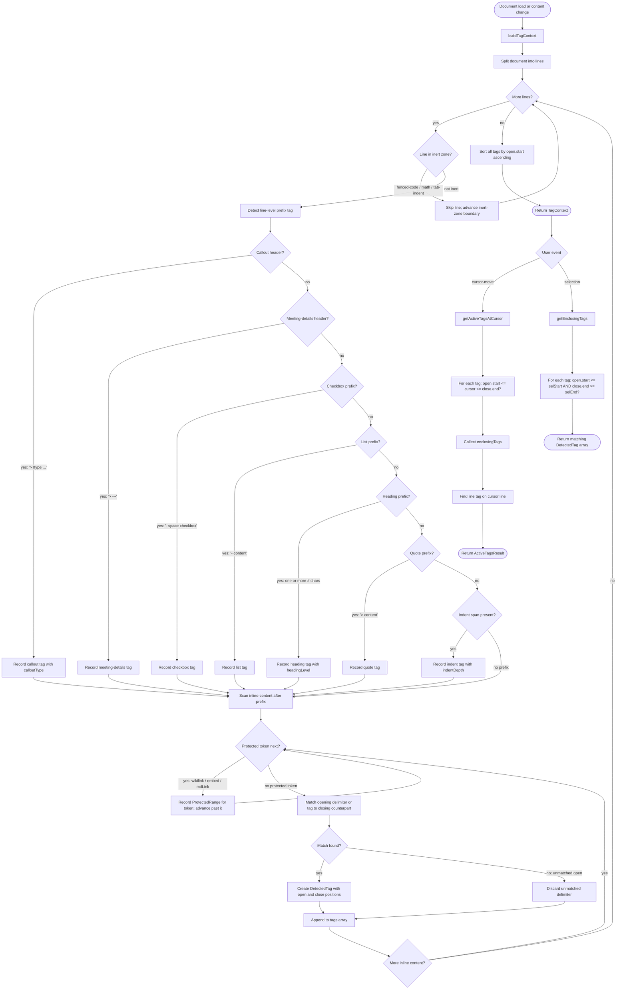

# Detection Engine v2 — Specification

## Purpose

Scan the full document once on load. Maintain an ordered list of all detected tags in a `TagContext`. Rebuild the context (debounced) after every content change. Expose a query API for the styling engine to ask "what tags are active here?".

---

## Public API

| Function                | Signature                                                 | Description                                                             |
| ----------------------- | --------------------------------------------------------- | ----------------------------------------------------------------------- |
| `buildTagContext`       | `(content: string) → TagContext`                          | Full document scan. Call on load and after debounced change.            |
| `getActiveTagsAtCursor` | `(context, cursorPosition) → ActiveTagsResult`            | Returns all closing tags enclosing the cursor plus the active line tag. |
| `getEnclosingTags`      | `(context, selectionStart, selectionEnd) → DetectedTag[]` | Returns all tags whose range fully covers the selection.                |

---

## Tag Categories

| Category      | Examples                                                            | Has open/close? | Has line prefix? |
| ------------- | ------------------------------------------------------------------- | --------------- | ---------------- |
| MD Closing    | `**bold**`, `*italic*`, `~~strike~~`, `==highlight==`, `` `code` `` | Yes             | No               |
| HTML Closing  | `<b>`, `<i>`, `<s>`, `<u>`, `<sub>`, `<sup>`                        | Yes             | No               |
| HTML Span     | `<span style="color:red">`, `<span style="font-size:14pt">`         | Yes             | No               |
| Single / Line | `- `, `# `, `> `, `<span style="margin-left:24px"/>`                | open only       | Yes              |
| Special       | `- [ ] `, `> [!type]`, `#todo`, meeting-details block               | open only       | Yes (block)      |

---

## Inert Zones — never scan inside

| Zone               | Marker                |
| ------------------ | --------------------- |
| Fenced code block  | ` ```...``` `         |
| Math block         | `$$...$$`             |
| Tab-indented block | Line starts with `\t` |

Detection skips all tag-scanning inside inert zones. Tags that start outside and would extend into an inert zone are truncated at the zone boundary.

---

## Protected Tokens — recorded but not split

| Token         | Type        |
| ------------- | ----------- |
| `[[...]]`     | wikilink    |
| `![[...]]`    | embed       |
| `[text](url)` | mdLink      |
| `[^ref]`      | footnoteRef |

These are recorded as `ProtectedRange` entries in `TagContext`. The styling engine uses them to punch out around these tokens.

---

## Logic Diagram



---

## Examples at Each Detection Path

| Path        | Input                               | Detected Tag                                                   |
| ----------- | ----------------------------------- | -------------------------------------------------------------- |
| MD bold     | `**hello**`                         | `type='bold', isHTML=false, open={0,0→0,2}, close={0,7→0,9}`   |
| MD italic   | `*world*`                           | `type='italic', isHTML=false, open={0,0→0,1}, close={0,6→0,7}` |
| HTML bold   | `<b>hi</b>`                         | `type='bold', isHTML=true, open={0,0→0,3}, close={0,5→0,9}`    |
| Span color  | `<span style="color:red">hi</span>` | `type='color', isHTML=true, isSpan=true`                       |
| Fenced code | ` ```\ncode\n``` `                  | Nothing inside; inert zone recorded                            |
| List line   | `- item`                            | `type='list', open={0,0→0,2}, no close`                        |
| Heading h2  | `## Title`                          | `type='heading', headingLevel=2, open={0,0→0,3}`               |
| Callout     | `> [!note] My Note`                 | `type='callout', calloutType='note', open={0,0→0,3}`           |
| Wikilink    | `[[Page]]`                          | ProtectedRange recorded; not a tag                             |
| Checkbox    | `- [ ] task`                        | `type='checkbox', open={0,0→0,6}`                              |
| Indent span | `<span style="margin-left:48px"/>`  | `type='indent', indentDepth=2`                                 |
