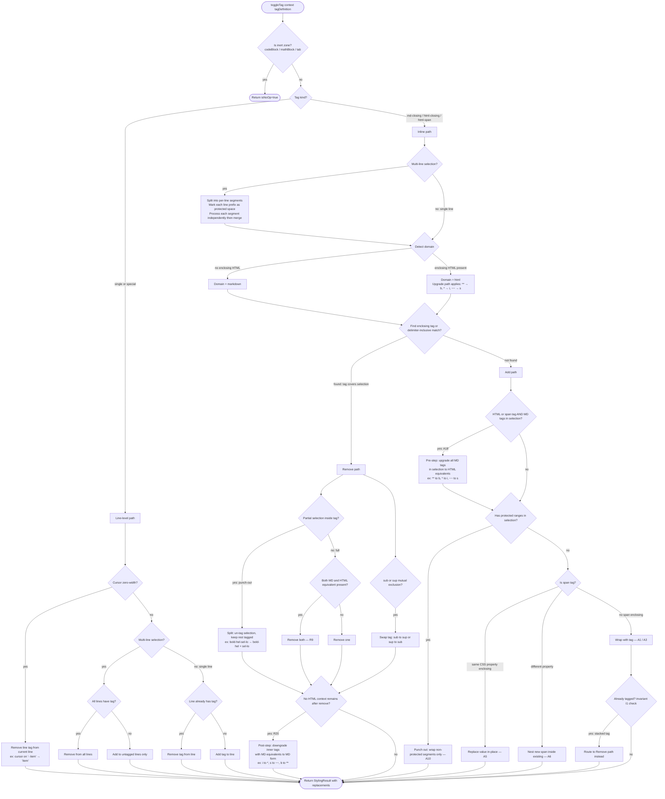

# Styling Engine v2 — Specification

## Purpose

Apply, remove, and query formatting on a text selection. The single public entry point is `toggleTag`. `removeAllTags` and `copyFormat` are separate functions. All functions are pure: they accept a `StylingContext` (text + offsets) and return a `StylingResult` (replacements list).

---

## Public API

| Function        | Signature                                  | Description                                            |
| --------------- | ------------------------------------------ | ------------------------------------------------------ |
| `toggleTag`     | `(context, tagDefinition) → StylingResult` | Add or remove a tag. Decision follows Word-like rules. |
| `removeAllTags` | `(context) → StylingResult`                | Remove all enclosing and interior tags from selection. |
| `copyFormat`    | `(context) → CopiedFormat`                 | Capture all active tags at cursor/selection for paste. |

---

## Tag Types

| Type         | Tags                                                            | Key Rule                                                                     |
| ------------ | --------------------------------------------------------------- | ---------------------------------------------------------------------------- |
| MD Closing   | `**` `*` `~~` `==` `` ` ``                                      | Prefer in plain context; upgrade to HTML equivalent when inside HTML context |
| HTML Closing | `<b>` `<i>` `<s>` `<u>` `` ``                         | Always HTML; compounds freely with other HTML tags                           |
| HTML Span    | color, font-size, font-family, background, align                | Compoundable; same CSS property name → replace value, never double-wrap      |
| Single       | `- ` list, `# ` heading, `> ` quote, `margin-left` indent       | Line-level; applied to whole line regardless of inline selection position    |
| Special      | `- [ ]` checkbox, `> [!type]` callout, `#todo`, meeting-details | Block/page-level; unique rules per tag                                       |

---

## toggleTag — Add vs Remove Decision

`[text]` = current selection. Golden rule: do what Microsoft Word does.

| Selection State                       | Inline (MD / HTML / Span)                                      | Single / Special                  |
| ------------------------------------- | -------------------------------------------------------------- | --------------------------------- |
| Cursor (zero-width)                   | Remove enclosing tag at cursor; if none, mark insertion format | Remove line tag from current line |
| Inert zone (fenced code / tab / math) | No-op                                                          | No-op                             |
| Tag fully covers selection            | **Remove**                                                     | **Remove** from line              |
| Selection fully inside tag (partial)  | **Remove** — punch-out selected portion                        | **Remove** from line              |
| Selection spans tag boundary          | **Add** — extend tag to cover selection                        | N/A (line-level handles it)       |
| No tag in selection                   | **Add**                                                        | **Add**                           |
| Multi-line: all lines tagged          | **Remove** from all                                            | **Remove** from all               |
| Multi-line: some lines tagged (mixed) | **Add** to untagged lines (Word: make uniform)                 | **Add** to untagged lines         |
| Multi-line: no lines tagged           | **Add** to all                                                 | **Add** to all                    |

---

## On Add

| #   | Scenario                                             | Behavior                                                                                   | Before → After                                                                                                                |
| --- | ---------------------------------------------------- | ------------------------------------------------------------------------------------------ | ----------------------------------------------------------------------------------------------------------------------------- |
| A1  | MD tag, plain context                                | Wrap with MD delimiters                                                                    | `[hello]` → `**[hello]**`                                                                                                     |
| A2  | MD tag, HTML context (enclosing HTML present)        | Upgrade to HTML equivalent                                                                 | `<b>x</b> [hello]` → `<b>x</b> <b>[hello]</b>`                                                                                |
| A3  | HTML closing tag                                     | Wrap with HTML tag                                                                         | `[hello]` → `<b>[hello]</b>`                                                                                                  |
| A4  | Span tag, no enclosing same-property                 | Wrap with new span                                                                         | `[hello]` → `[hello]`                                                                          |
| A5  | Span tag, same CSS property already enclosing        | Replace attribute value only — no double-wrap                                              | `[hello]` → `[hello]`                                          |
| A6  | Span tag, different CSS property already enclosing   | Compound: nest new span inside existing                                                    | `[hi]` + font-size → `[hi]` |
| A7  | Selection spanning tag boundary (partial overlap)    | Extend existing tag to cover full selection                                                | `**hel**[lo world]` → `**hel[lo world]**`                                                                                     |
| A8  | MD tag already present, HTML equivalent also present | Treat as already tagged → Remove path instead                                              | (see R9)                                                                                                                      |
| A9  | Adjacent same-type tags crossing selection           | If all content covered → Remove path; if partial → extend/merge                            | `**a** [b] **c**` all bold → Remove; `**a**[ b **c**]` partial → extend to `**a b c**`                                        |
| A10 | Protected range inside selection                     | Punch out: wrap non-protected segments separately                                          | `[[link]] [hello]` → `[[link]] **hello**`                                                                                     |
| A11 | Multi-line: none tagged                              | Add to all lines                                                                           | `l1\nl2` → `**l1**\n**l2**`                                                                                                   |
| A12 | Multi-line: some tagged (mixed)                      | Add to untagged lines only                                                                 | `**l1**\nl2` → `**l1**\n**l2**`                                                                                               |
| A13 | Single: list                                         | Prepend `- ` to each selected line                                                         | `item` → `- item`                                                                                                             |
| A14 | Single: heading (h1–h6)                              | Prepend `# ` at specified level to each line                                               | `title` → `# title`                                                                                                           |
| A15 | Single: quote                                        | Prepend `> ` to each line                                                                  | `note` → `> note`                                                                                                             |
| A16 | Single: indent                                       | Insert `` after all other line prefixes; N += 24 per toggle | `- item` → `- item`                                                                           |
| A17 | Multi-line inline selection                          | Split into per-line segments; process each line independently; line prefix (`- ` / `# ` / `> `) on each line is a **protected space** — never wrapped by the inline tag | `- hello\n- world` + bold → `- **hello**\n- **world**`                                                                        |
| A18 | HTML or span tag add when MD tags present in selection | Pre-step: upgrade all MD tags within the selection to their HTML equivalents before wrapping (enforces invariant I2 proactively) | `**hello** world` + italic → upgrade `**`→`<b>`, then wrap → `<i><b>hello</b> world</i>`                                      |

---

## On Remove

| #   | Scenario                                                    | Behavior                                                           | Before → After                                                                      |
| --- | ----------------------------------------------------------- | ------------------------------------------------------------------ | ----------------------------------------------------------------------------------- |
| R1  | MD tag, selection matches tag exactly                       | Remove both delimiters                                             | `**[hello]**` → `[hello]`                                                           |
| R2  | MD tag, partial selection inside tag (punch-out)            | Split: un-tag selected portion; keep surrounding text tagged       | `**hel[lo]**` → `**hel**[lo]`                                                       |
| R3  | MD tag, selection includes delimiters (delimiter-inclusive) | Remove delimiters cleanly                                          | `[**hello**]` → `[hello]`                                                           |
| R4  | MD tag in HTML context; HTML equivalent present             | Remove HTML equivalent                                             | `<b>[hello]</b>` → `[hello]`                                                        |
| R5  | HTML closing, full selection                                | Unwrap HTML tag                                                    | `<b>[hello]</b>` → `[hello]`                                                        |
| R6  | HTML closing, partial selection (punch-out)                 | Split: leave unselected portion still tagged                       | `<b>hel[lo]</b>` → `<b>hel</b>[lo]`                                                 |
| R7  | HTML span, property name match (any value)                  | Remove span entirely                                               | `[hi]` → `[hi]`                                      |
| R8  | HTML span, partial selection inside span (punch-out)        | Split span: un-span selected portion                               | `hel[lo]` → `hel[lo]` |
| R9  | MD + HTML equivalent both enclosing                         | Remove both                                                        | `<b>**[hello]**</b>` → `[hello]`                                                    |
| R10 | sub present, toggle sup                                     | Swap entire tag `` → `` (mutual exclusion)               | `[x]` + toggle sup → `[x]`                                    |
| R11 | sup present, toggle sub                                     | Swap entire tag `` → ``                                  | `[x]` + toggle sub → `[x]`                                    |
| R12 | sub/sup partial selection                                   | Punch-out selected portion from the swapped tag                    | `hel[lo]` + toggle sup → `hel[lo]`                            |
| R13 | Stacked same-type (`<b><b>text</b></b>`)                    | Remove all duplicate layers in one pass                            | `<b><b>[hello]</b></b>` → `[hello]`                                                 |
| R14 | Multi-line: all tagged                                      | Remove from all                                                    | `**l1**\n**l2**` → `l1\nl2`                                                         |
| R15 | Multi-line: mixed (some tagged)                             | Remove from tagged lines only                                      | `**l1**\nl2` → `l1\nl2`                                                             |
| R16 | Single: list                                                | Remove `- ` prefix                                                 | `- [item]` → `[item]`                                                               |
| R17 | Single: heading                                             | Remove `# ` prefix                                                 | `# [title]` → `[title]`                                                             |
| R18 | Single: quote                                               | Remove `> ` prefix                                                 | `> [note]` → `[note]`                                                               |
| R19 | Single: indent                                              | Decrease margin-left by 24px; remove span entirely when reaching 0 | `item` → `item`     |
| R20 | Last HTML tag removed from context; inner tags have MD equivalents | Post-step: downgrade all inner HTML tags with MD equivalents to MD form. Tags with no MD equivalent (spans, `<u>`) remain as HTML | `<b><i>hello</i></b>` remove bold → `*hello*`; `<b>hi</b>` remove bold → `hi` |

---

## Cross-Type Interactions

| #   | Scenario                                                   | Behavior                                                                           |
| --- | ---------------------------------------------------------- | ---------------------------------------------------------------------------------- |
| X1  | MD tag + HTML equivalent both present                      | Treat as "tag present" → Remove both (R9)                                          |
| X2  | MD tag applied inside HTML context                         | Upgrade: `**`→`<b>`, `*`→`<i>`, `~~`→`<s>`, `==`→`` |
| X3  | sub + sup mutual exclusion                                 | Toggling the opposite tag swaps the entire enclosing tag                           |
| X4  | Heading applied to list line                               | Swap: remove `- `, prepend `# `                                                    |
| X5  | List applied to heading line                               | Swap: remove `# `, prepend `- `                                                    |
| X6  | Quote + list on same line                                  | Coexist: `> - item`; toggling list on `> item` → `> - item`                        |
| X7  | Quote + heading on same line                               | Coexist: `> # heading`                                                             |
| X8  | Callout line + list toggle                                 | Add/remove list on content lines; callout header untouched                         |
| X9  | Indent applied to line with list/heading/quote             | Indent placed after line prefix; prefixes unaffected                               |
| X10 | Inline tag on selection spanning line prefix (`>` / `-` / `#`) | Line prefix is a **protected space** — inline tag wraps only the content after the prefix, never the prefix characters themselves | `> note` + bold → `> **note**`; `- item` + bold → `- **item**` |
| X11 | Inline toggle on multi-paragraph selection                 | Apply inline logic per-line; single-tag logic also per-line                        |
| X12 | `code` tick inner content                                  | Content inside code ticks is inert                                                 |
| X13 | highlight `==` default pen (yellow)                        | MD `==` maps to `` in HTML context                |
| X14 | highlight `==` custom pen color                            | Always use ``, never `==` for non-default pen       |
| X15 | Callout on callout (different type)                        | Nested callout: add extra `> ` level + new header on content lines                 |
| X16 | Checkbox on callout header                                 | Replace header with `- [ ] title`; remove one `> ` from all children               |
| X17 | Indent inside list item                                    | Use `\t` tab, not `margin-left` span                                               |
| X18 | List removed with tab indent                               | Also remove all leading `\t` characters from that line                             |

---

## Special / Unique Tags

| Tag                       | Add                                                  | Remove                                                             |
| ------------------------- | ---------------------------------------------------- | ------------------------------------------------------------------ |
| Checkbox `- [ ]`          | Prepend `- [ ] `; replace `- ` if list present       | Remove `- [ ] ` prefix                                             |
| Callout `> [!type] title` | Insert header; prepend `> ` to content lines         | Remove header; preserve inner content as bare `> ` lines           |
| Quote `> `                | Prepend `> ` to each line; if callout present, no-op | Remove `> ` prefix; if callout present, delegate to callout remove |
| Meeting details           | Toggle page-level block at document top              | Remove entire block                                                |

---

## Protected Ranges

On **add**: punch out — split at the protected token boundary; apply the tag to non-protected segments on either side.
On **remove of the protected token itself**: reconcile the punch-out — strip delimiters and merge adjacent same-type tags.
On **remove of an outer tag that was punched out**: remove that tag from all non-protected segments together.

| Token                 | On Add (punch out)                               | On Remove token (reconcile)                    | On Remove outer tag                              |
| --------------------- | ------------------------------------------------ | ---------------------------------------------- | ------------------------------------------------ |
| Wikilink `[[...]]`    | `**before**[[link]]**after**`                    | Remove `[[` `]]`; merge: `**beforelinkafter**` | Remove from both segments: `before[[link]]after` |
| Embed `![[...]]`      | Same as wikilink                                 | Same                                           | Same                                             |
| MD link `[t](url)`    | Same as wikilink                                 | Same                                           | Same                                             |
| Code `` `...` ``      | `**before**\`code\`**after**`                    | Remove backticks; merge: `**beforecodeafter**` | `before\`code\`after`                            |
| Todo `#todo`          | `**before**#todo**after**`                       | Remove `#todo`; merge: `**beforeafter**`       | `before#todoafter`                               |
| Meeting details block | Entire block inert — no tags inside or around it | N/A                                            | No-op                                            |

---

## Line Tag Precedence (on same line)

| Priority | Tag                 | Mutual Exclusion                              | Notes                                                      |
| -------- | ------------------- | --------------------------------------------- | ---------------------------------------------------------- |
| 1        | Callout `> [!type]` | Replaces or nests over any other line prefix  | Applying over another callout creates nested callout (X15) |
| 2        | List `- `           | Excludes heading and checkbox at prefix level | Can coexist inside callout (`> - item`)                    |
| 3        | Indent              | —                                             | In list: `\t`; outside list: `margin-left` span            |
| 4        | Heading `# `        | Excludes list and checkbox                    | Swaps with list (X4/X5)                                    |
| 4        | Checkbox `- [ ]`    | Excludes list and heading                     | Same priority as heading; replaces callout header (X16)    |

---

## Invariants (never violate)

| #   | Rule                                                                                                                         |
| --- | ---------------------------------------------------------------------------------------------------------------------------- |
| I1  | **No stacked active tags** — if a tag is already active, never wrap again; remove or replace only                            |
| I2  | **No MD delimiters inside HTML context** — `**` `*` `~~` `==` must never appear inside an enclosing HTML tag; always upgrade |
| I3  | **No inline tags inside code spans** — code content is always inert                                                          |
| I4  | **Line tags at line start** — single-line tags always operate on the line prefix position                                    |
| I5  | **Indent in list = tab** — inside list: `\t`; outside list: ``                               |
| I6  | **Indent removed with list** — when list marker removed, all leading `\t` characters also removed                            |

---

## Logic Diagram

---

## removeAllTags — Logic

1. Collect all tags that wrap around the selection from outside (enclosing).
2. Collect all tags fully inside the selection.
3. Sort combined list last-to-first by position.
4. Generate unwrap replacements for each — deduplicate overlapping ranges.
5. For multi-line selections: also remove single-line tags if line-start is within selection.

## copyFormat — Logic

1. Collect all active and enclosing inline tags at cursor/selection (not just enclosing — includes tags with format mark-in-progress at cursor).
2. Include line-level tags if the line-start is within the selection.
3. Map each to its `TagDefinition`.
4. Detect domain (MD or HTML) at cursor.
5. Return `{ tagDefinitions, domain, lineTagDefinition }`.

**On paste**: reconcile against the new selection — for each tag in the copied format, toggle it if not already present on the destination. Apply line-level tags at the start of each destination line.
